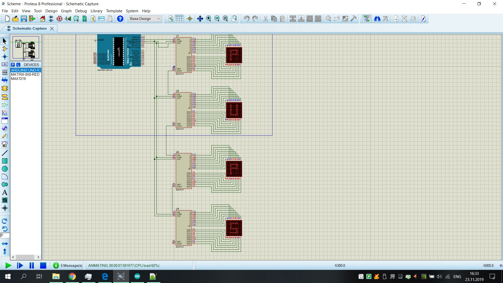
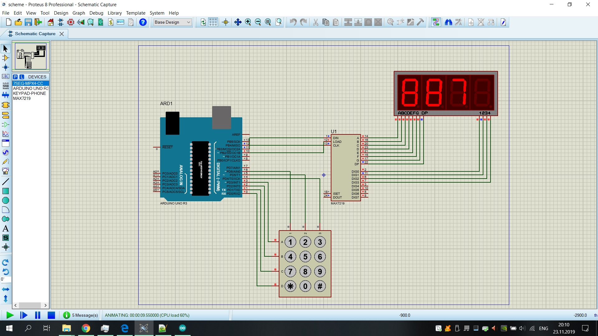
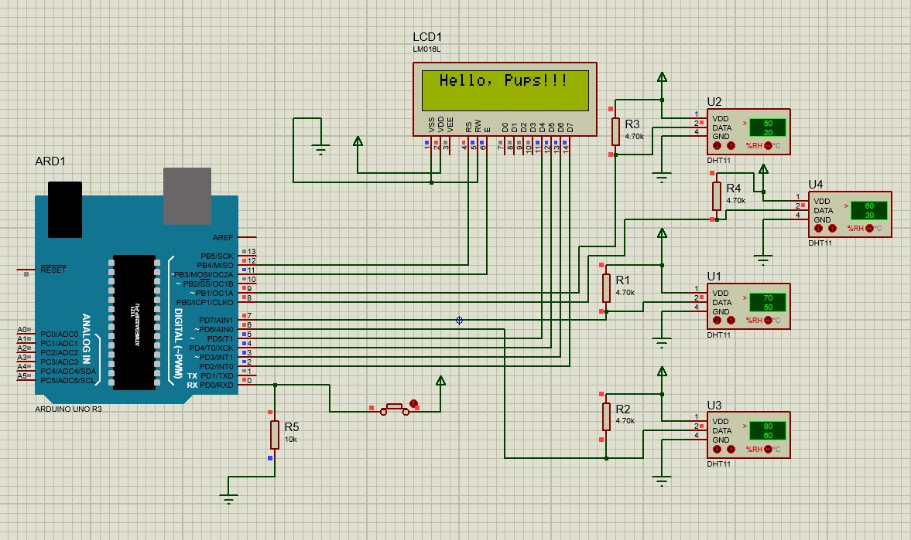
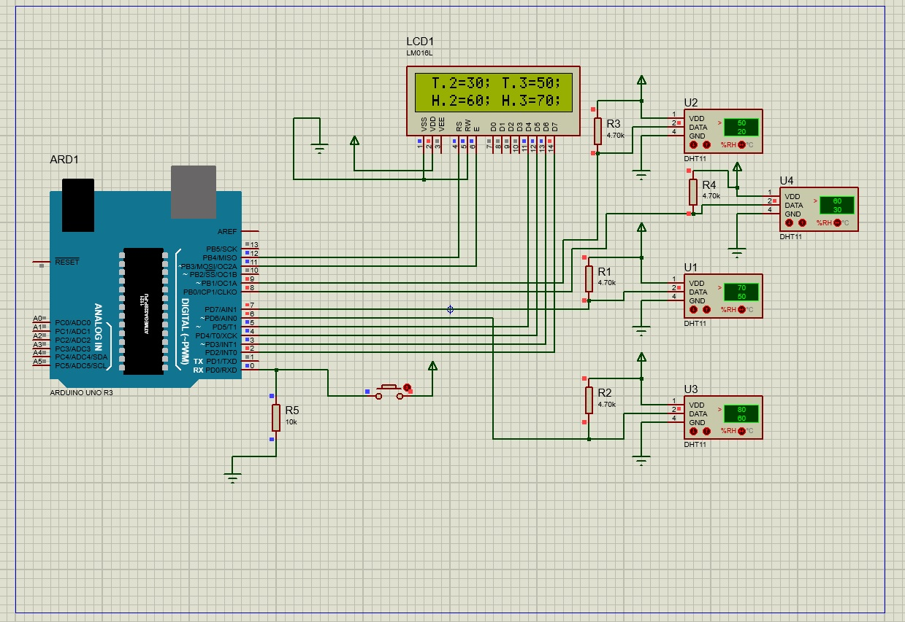
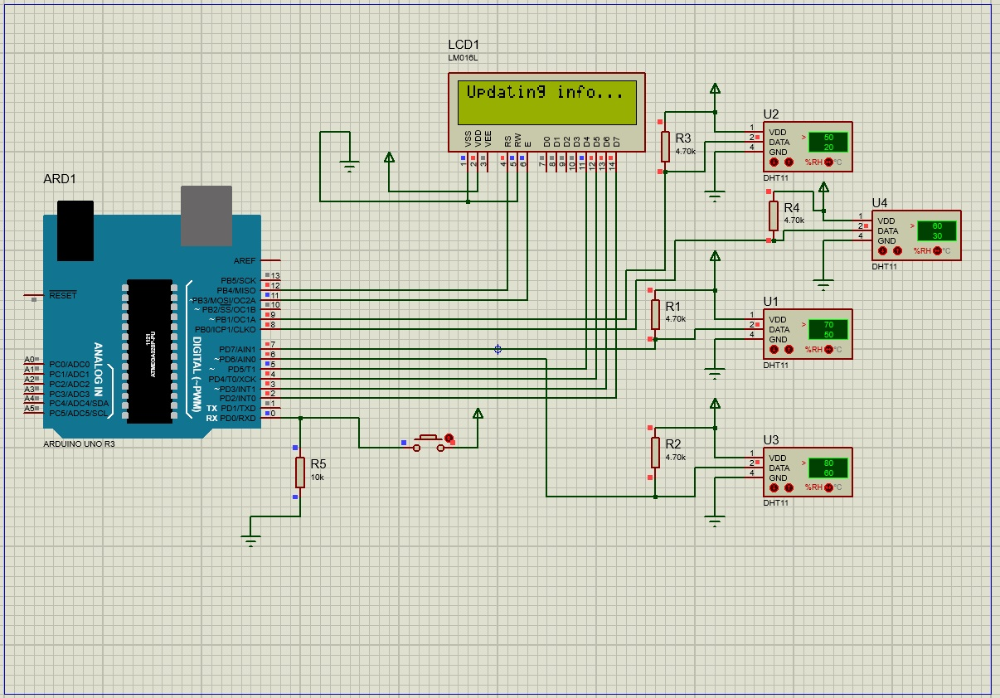
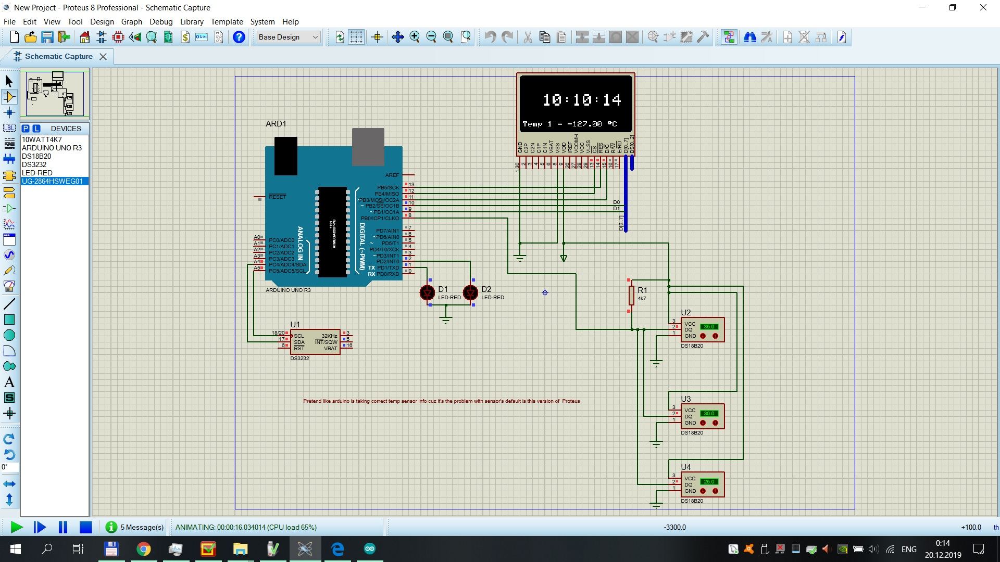
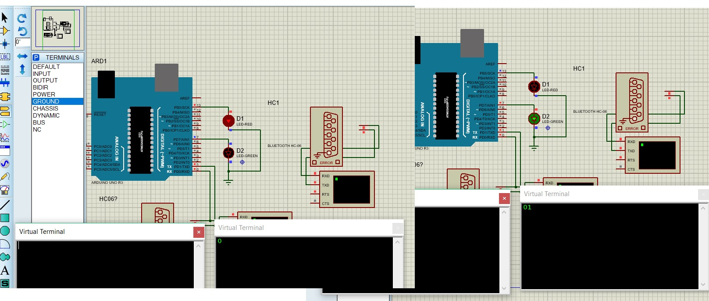

# ArduinoWorkspace

## Uno+Max7219+LedMatrix

## Uno+Max7219+Keypad+7Seg

## Uno+LiquidCristalDispl+DHL
### Greetings

### Displaying info from sensors

### Info messages

## Uno+OLED+Temp.DS18B20+RTC DS3231
### Example

## UNO-UART+Bluetooth
### Traffic Lights

